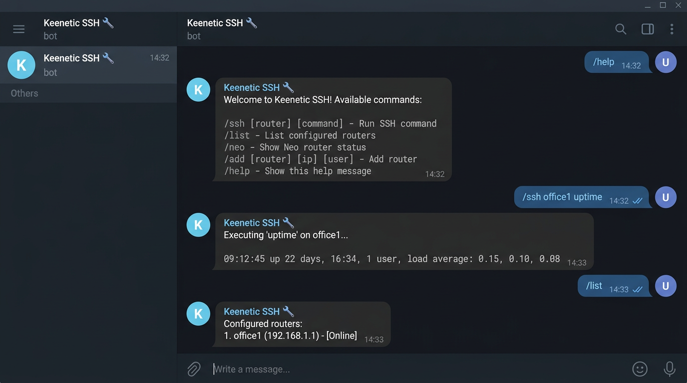

# Keenetic SSH через Telegram

Минимальный бот: пишешь команду в Telegram — она уходит на роутер по SSH. Без веб-морды, без графиков — зато ставится за пару минут на старый VPS.

Команды и логика SSH — из [keenetic-unified](https://github.com/andrey271192/keenetic-unified); если нужен полный дашборд, берите тот проект.



---

## Возможности

- `/ssh имя команда` и `/ssh all команда` — выполнение на одном или всех роутерах (verbose: exit-код, вывод)
- `/neo`, `/uptime`, `/interfaces`, `/reboot`, `/ping`
- `/add`, `/setip`, `/setname`, `/setweb`, `/delete`, `/list`, `/router`
- Список роутеров хранится в `data/routers.json` на сервере

---

## Требования

- Ubuntu 22/24 (или другой Linux с systemd)
- `sshpass`, `openssh-client`, Python 3.10+
- Токен бота и **один** chat ID (бот отвечает только этому чату)

---

## Установка

```bash
git clone https://github.com/andrey271192/Keenetic_SSH.git /opt/keenetic-ssh
cd /opt/keenetic-ssh
bash install.sh
nano .env
```

Пример `.env` (подставь свои значения из [@BotFather](https://t.me/BotFather) и свой числовой chat id):

```env
TELEGRAM_TOKEN=000000000:AAAAAAAAAAAAAAAAAAAAAAAAAAAAAAAAAA
TELEGRAM_CHAT_ID=000000000

SSH_USER=root
SSH_PASS=your_router_password
```

Перезапуск после правок `.env`:

```bash
systemctl restart keenetic-ssh
```

Логи:

```bash
journalctl -u keenetic-ssh -f
```

---

## Роутеры

Добавить из Telegram (имя, IP и при необходимости логин/пароль SSH):

```
/add office1 192.168.1.1 root your_password
```

Или отредактировать `data/routers.json` на сервере:

```json
{
  "office1": {
    "ip": "192.168.1.1",
    "user": "root",
    "password": "your_password",
    "display_name": "Офис 1",
    "web_url": ""
  }
}
```

Поле `wan_ip` поддерживается как запасной вариант, если `ip` пустой.

---

## Команды бота

| Команда | Описание |
|--------|----------|
| `/help` | Справка |
| `/list` | Список роутеров |
| `/router имя` | Карточка |
| `/ssh имя команда` | SSH на роутер |
| `/ssh all команда` | На всех с IP |
| `/neo имя status\|restart` | Neo |
| `/uptime`, `/interfaces`, `/reboot` | Как в SSH |
| `/ping имя` | Ping с VPS до IP роутера |
| `/add имя IP [user] [pass]` | Добавить |
| `/setip`, `/setname`, `/setweb`, `/delete` | Настройка |

---

## Поддержка

[Boosty — донат](https://boosty.to/andrey27/donate)

**Связь:** [Telegram @Iot_andrey](https://t.me/Iot_andrey) — вопросы и обратная связь.

---

## Обновление

```bash
cd /opt/keenetic-ssh && git pull && systemctl restart keenetic-ssh
```

## Удаление с сервера (одной командой)

Останавливается `keenetic-ssh`, удаляется unit и каталог **`/opt/keenetic-ssh`**:

```bash
curl -fsSL https://raw.githubusercontent.com/andrey271192/Keenetic_SSH/main/uninstall.sh | sudo bash
```

Из каталога установки: `sudo bash uninstall.sh`
